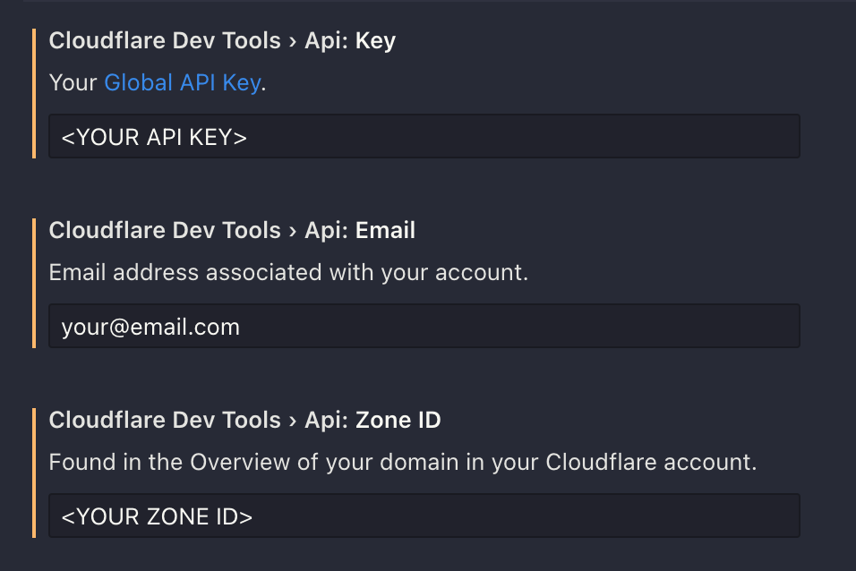

# Cloudflare DevTools

A [Visual Studio Code extension](https://marketplace.visualstudio.com/items?itemName=AlessandroBenassi.cloudflare-devtools) to manage Cloudflare's **Development Mode** and purge the **Cache** from within VS Code.

The extension relies on [Cloudflare's API](https://api.cloudflare.com/) and will send requests in the background to set/retrive the Development Mode status.

&nbsp;

## Features

- Turn Cloudflare's **Development Mode On/Off**.
- Check Cloudflare's **Development Mode's status** _(On or Off)_ by highlighting an icon in the **status bar** _(optional)_.
- Purge Cloudflare's **cache** _(with option to purge it automatically when you turn Development Mode on)_.

&nbsp;

&nbsp;

## Getting started

**1. Open the [Extension's Settings](#extension-settings) and fill in these required fields:**

**2. To reveal the available commands, you have several options:**

- Click on the cloud icon in the **Status Bar**
- Use the tree view in the **Activity Bar**
- Invoke the commands from the **Command Palette**

Whatever option you choose, the status bar icon will be highlighted while Development Mode is on (unless disabled in the settings).
The color depends on your theme's `statusBarItem.warningBackground`.

&nbsp;

## Extension Settings

This extension contributes the following settings:

- `cloudflareDevTools.api.key`: Your Cloudflare API key, generated on the [My Account](https://dash.cloudflare.com/profile/api-tokens) page.
  - _Permissions_:
    - `Zone > Zone Settings > Edit`
    - `Zone > Zone > Edit`
  - _Zone Resources_:
    - `Include > Specific zone > your_domain`
- `cloudflareDevTools.api.email`: Email address associated with your account.
- `cloudflareDevTools.api.zoneID`: Your zone ID, found in the Overview of your domain in your Cloudflare account.
- `cloudflareDevTools.cache.purgeAutomatically`: Purge Cloudflare's cache automatically after turning on `Development Mode.
- `cloudflareDevTools.developmentModeStatus.enable`: Sends periodic requests to the API to check whether `Development Mode` is `On` or `Off`. _(Recommended - will update the cloud icon's appearance in the status bar depending on Dev. Mode's status)_."
- `cloudflareDevTools.developmentModeStatus.interval`: How often _(in seconds)_ to ping the API, to check whether `Development Mode` is On or Off. `cloudflareDevTools.developmentModeStatus.enable` needs to be `true`.

&nbsp;

## Useful Links

- [Cloudflare API](https://api.cloudflare.com/)
- [GitHub Repository](https://github.com/solid-pixel/vscode-cloudflareDevTools)
- [Extension on the VS Code Marketplace](https://marketplace.visualstudio.com/items?itemName=alessandro-benassi.cloudflare-devtools)
- [My LinkedIn profile](https://www.linkedin.com/in/ap-benassi/)

&nbsp;

## Changelog

[Click here to see the changelog](https://marketplace.visualstudio.com/items/AlessandroBenassi.cloudflare-devtools/changelog).

&nbsp;

## Have feedback or issues?

Please [file an issue](https://github.com/solid-pixel/vscode-cloudflareDevTools/issues/new) on the GitHub repository.

&nbsp;

## I love Pizza 🍕

&nbsp;
